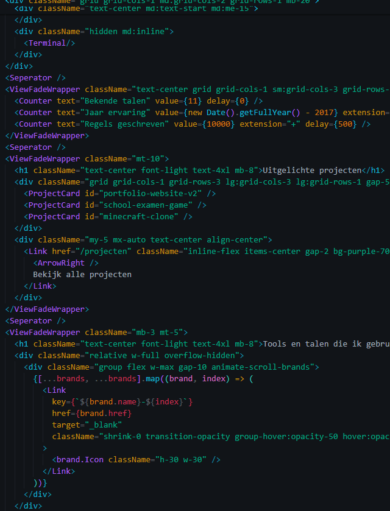

  
# Hi, I'm [Julian](https://github.com/jul1xn) 👋

I'm a **Software Development** student from the Netherlands with a passion for building software and learning new technologies. I started programming at a young age and have mostly taught myself by researching, experimenting, and trying out new ideas.

I'm mainly interested in **back-end development** and **app development**, but I also enjoy creating small game projects in my spare time. I like understanding how things work under the hood and finding creative solutions to problems.

I work well independently, but I also enjoy collaborating with others. I'm a calm and curious person who likes taking on challenges and continuously improving my skills.

Besides programming, I enjoy gaming, making music, and working on mechanical projects. I don't know exactly where my future in tech will take me yet, but I know I want to keep learning, building, and exploring new possibilities.

### My tech stack:
               

 

---

### 🌍 Find me:

- 🧠 Learning on [Github](https://github.com/jul1xn)
- 📂 View my work on my [Portfolio](https://portfolio.prowser.nl)
- 💼 Connect with me on [LinkedIn](https://linkedin.com/in/julian-v-84a02a356)
- 💬 Contact me @ [julian.verwoerd@prowser.nl](mailto:julian.verwoerd@prowser.nl)
